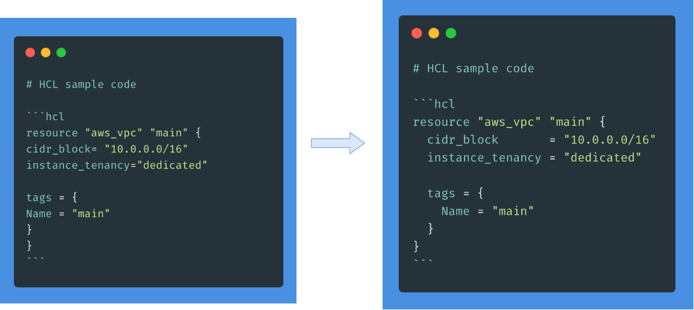

# tffmtmd

 



tffmtmd formats HCL source code block in Markdown. detects fenced code & formats code.

Inspired by [gofmtmd](https://github.com/po3rin/gofmtmd)

## Installation

```
$ go get github.com/fukubaka0825/tffmtmd/cmd/tffmtmd
```

## Usage

```bash
# replace HCL code with formated code
$ tffmtmd testdata/testdata.md -r

# write result to file instead of stdout
$ tffmtmd testdata/testdata.md -w output.md
```

## Help

```bash
-> % tffmtmd -h
Usage: tffmtmd [options...] filePath

tffmtmd is a command line tool to format HCL code in Markdown.

OPTIONS:
  --replace value, -r value  replace HCL code with formated code
  --write value, -w value    write result to file instead of stdout
  --help, -h              prints out help
```
